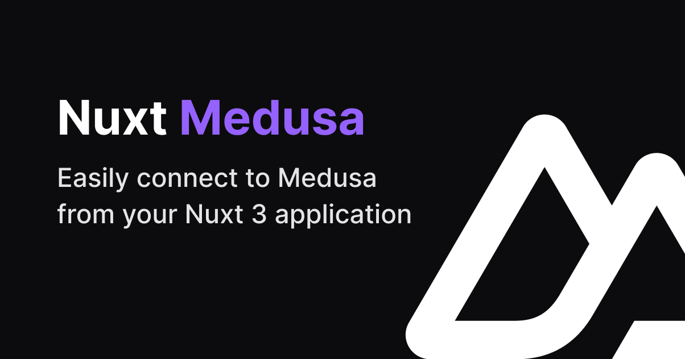

# Nuxt Medusa

[](https://nuxt-medusa.vercel.app)

[![npm version][npm-version-src]][npm-version-href]
[![npm downloads][npm-downloads-src]][npm-downloads-href]
[![License][license-src]][license-href]

[Medusa](https://medusajs.com) module for Nuxt.

- [▶️  &nbsp;Play online](https://stackblitz.com/github/baroshem/nuxt-medusa?file=.stackblitz%2Fnuxt.config.ts)
- [📖 &nbsp;Documentation](https://nuxt-medusa.vercel.app)
- [🎥 &nbsp;Intro video](https://www.youtube.com/watch?v=EuakPz8M7CM)
- [✨ &nbsp;Release Notes](https://github.com/baroshem/nuxt-medusa/releases)

## Features

- Nuxt 3 ready
- Wrapper around `@medusajs/js-sdk`
- Handy composables like `useMedusaClient`
- Usage in API server routes with `serverMedusaClient`
- TypeScript support

## Quick Setup

1. Add `nuxt-medusa` dependency to your project

```bash
npx nuxi@latest module add medusa
```

2. Create .env file with following `MEDUSA_URL` variable:

```bash
MEDUSA_URL=<YOUR_MEDUSA_URL> # By default http://localhost:9000
```

And that's it! You can now fetch data from Medusa in Nuxt ✨

```vue
<script setup lang="ts">
  const client = useMedusaClient();
  const { products } = await client.store.product.list();
</script>
```

If you are encountering problems with `CORS` from Medusa, make sure that `process.env.STORE_CORS` in `medusa-config.js` file is pointing to your local Nuxt project. By default, Medusa has CORS set for `http://localhost:8000` while Nuxt is running by default on `http://localhost:3000`

## Development

```bash
# Install dependencies
yarn

# Generate type stubs
yarn dev:prepare

# Develop with the playground
yarn dev

# Build the playground
yarn dev:build

# Run ESLint
yarn lint

# Run Vitest
yarn test
yarn test:watch

# Release new version
yarn release
```

<!-- Badges -->
[npm-version-src]: https://img.shields.io/npm/v/nuxt-medusa/latest.svg?style=flat&colorA=18181B&colorB=28CF8D
[npm-version-href]: https://npmjs.com/package/nuxt-medusa

[npm-downloads-src]: https://img.shields.io/npm/dm/nuxt-medusa.svg?style=flat&colorA=18181B&colorB=28CF8D
[npm-downloads-href]: https://npmjs.com/package/nuxt-medusa

[license-src]: https://img.shields.io/npm/l/nuxt-medusa.svg?style=flat&colorA=18181B&colorB=28CF8D
[license-href]: https://npmjs.com/package/nuxt-medusa
